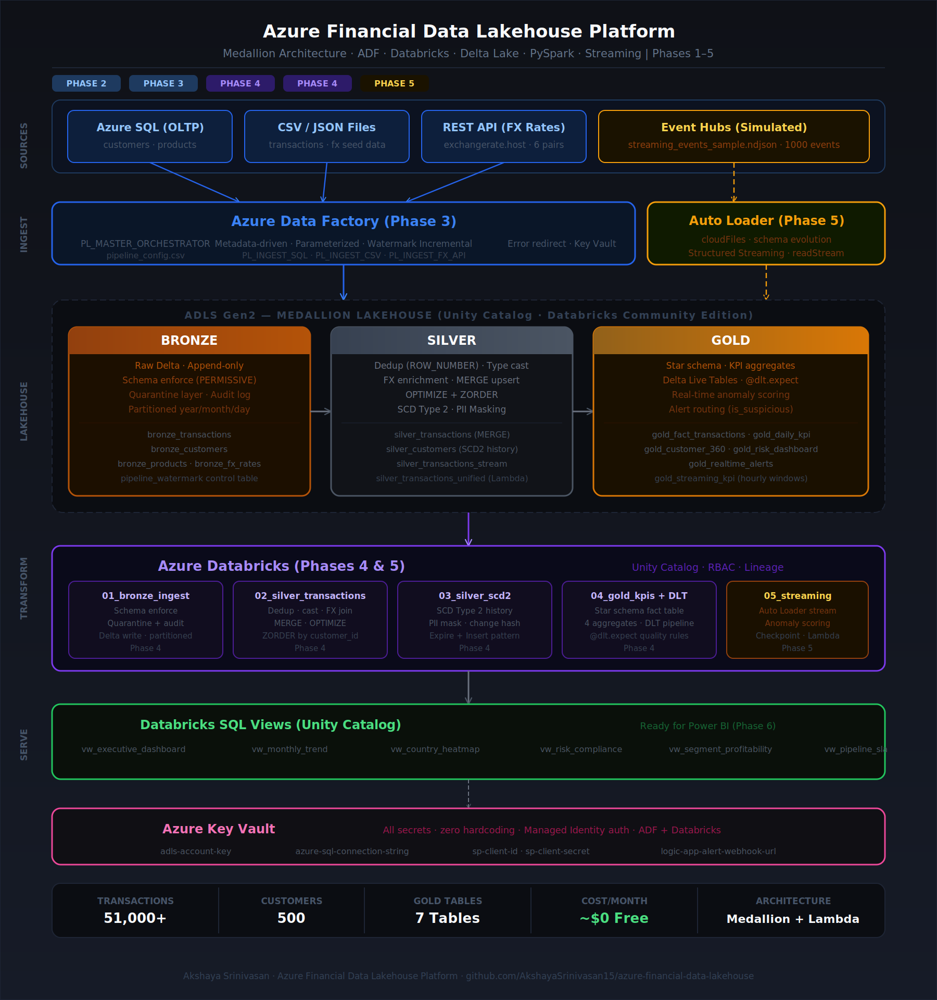

# Azure Financial Data Lakehouse Platform
### Enterprise-Grade Medallion Lakehouse | ADF · Databricks · Delta Lake · PySpark · Streaming

<br>

## Overview

End-to-end enterprise data engineering platform built on Microsoft Azure, implementing a **Medallion Lakehouse Architecture** (Bronze → Silver → Gold) for financial transaction analytics. The platform ingests multi-source financial data through automated ADF pipelines, transforms it via PySpark in Databricks, and serves business-ready aggregates for risk monitoring and executive reporting.

**Domain:** Financial Services — Retail Banking & Transaction Analytics  
**Scale:** 51,000+ transactions · 500 customers · 18 products · 6 currencies · 2-year FX history  
**Architecture:** Medallion Lakehouse (Delta Lake) + Lambda Architecture (Batch + Streaming)

---

## Architecture




┌─────────────────────────────────────────────────────────────────────────┐
│                          DATA SOURCES                                   │
│                                                                         │
│  Azure SQL (OLTP)   CSV / JSON Files   REST API (FX)   Event Hubs Sim  │
│   customers, products   transactions    exchangerate     streaming txns  │
└──────────────┬──────────────┬──────────────┬──────────────┬────────────┘
               │              │              │              │
               └──────────────┴──────┬───────┘              │
                                     │                       │
                         ┌───────────▼────────────┐  ┌──────▼──────────┐
                         │   Azure Data Factory   │  │  Auto Loader    │
                         │  Metadata-driven,      │  │  Structured     │
                         │  Parameterized,        │  │  Streaming      │
                         │  Watermark Incremental │  │  (Phase 5)      │
                         └───────────┬────────────┘  └──────┬──────────┘
                                     │                       │
               ┌─────────────────────▼───────────────────────▼──────────┐
               │             ADLS Gen2 — Medallion Lakehouse             │
               │                                                          │
               │  ┌─────────────┐  ┌─────────────┐  ┌─────────────┐    │
               │  │   BRONZE    │  │   SILVER    │  │    GOLD     │    │
               │  │  Raw Delta  │→ │  Cleansed   │→ │  Business   │    │
               │  │  Quarantine │  │  Deduped    │  │  Aggregates │    │
               │  │  Audit log  │  │  SCD Type 2 │  │  Star Schema│    │
               │  │             │  │  PII Masked │  │  KPI Tables │    │
               │  └─────────────┘  └─────────────┘  └─────────────┘    │
               └──────────────────────────┬───────────────────────────┘
                                          │
                              ┌───────────▼────────────┐
                              │   Azure Databricks     │
                              │                        │
                              │  PySpark Notebooks     │
                              │  Delta Live Tables     │
                              │  Unity Catalog         │
                              │  OPTIMIZE + ZORDER     │
                              └───────────┬────────────┘
```

---

## Tech Stack

| Layer | Technology |
|---|---|
| **Ingestion** | Azure Data Factory (ADF) — metadata-driven, parameterized pipelines |
| **Storage** | Azure Data Lake Storage Gen2 (ADLS) — Medallion containers |
| **Processing** | Azure Databricks — PySpark, Delta Lake, Delta Live Tables |
| **Streaming** | Auto Loader + Structured Streaming — Lambda Architecture |
| **Governance** | Databricks Unity Catalog — RBAC, data lineage, PII masking |

---

## Project Structure

```
azure-financial-data-lakehouse/
│
├── data_generators/                  # Synthetic financial data generators
│   ├── generate_customers.py         # 500 customers with PII fields
│   ├── generate_products.py          # 18 financial products (8 categories)
│   ├── generate_transactions.py      # 51,000 transactions (~2% dupes intentional)
│   ├── generate_fx_rates.py          # 2-year daily FX rates (GBM simulation)
│   ├── generate_streaming_events.py  # Real-time event simulator (Event Hubs format)
│   ├── run_all_generators.sh         # One-shot runner
│   └── requirements.txt
│
├── adf/                              # Azure Data Factory
│   ├── linked_services/
│   │   ├── LS_ADLS_Gen2.json         # ADLS Gen2 (Key Vault secret)
│   │   ├── LS_AzureSQL.json          # Azure SQL (Key Vault secret)
│   │   ├── LS_AzureKeyVault.json     # Key Vault (Managed Identity)
│   │   └── LS_HTTP_FX.json           # REST API (FX rates)
│   ├── datasets/
│   │   ├── DS_ADLS_Bronze_CSV.json   # Parameterized Bronze CSV dataset
│   │   ├── DS_AzureSQL_Source.json   # Parameterized SQL dataset
│   │   ├── DS_HTTP_FX_API.json       # FX REST API dataset
│   │   └── pipeline_config.csv       # Metadata config (drives all ingestion)
│   ├── pipelines/
│   │   ├── PL_MASTER_ORCHESTRATOR.json     # Master — reads config, loops sources
│   │   ├── PL_INGEST_SQL_TO_BRONZE.json    # SQL → Bronze (watermark incremental)
│   │   ├── PL_INGEST_FX_API_TO_BRONZE.json # REST API → Bronze
│   │   └── PL_INGEST_CSV_TO_BRONZE.json    # CSV → Bronze (error row redirect)
│   ├── triggers/
│   │   └── TRIG_Daily_1AM_UTC.json   # Scheduled daily trigger
│   └── sql_setup.sql                 # Azure SQL watermark + audit tables
│
├── databricks/
│   ├── bronze/
│   │   └── 01_bronze_ingest_transactions.py  # Schema enforce, quarantine, audit
│   ├── silver/
│   │   ├── 02_silver_transactions.py         # Dedup, cast, FX enrich, MERGE
│   │   └── 03_silver_customers_scd2.py       # SCD Type 2 + PII masking
│   ├── gold/
│   │   ├── 04_gold_financial_kpis.py         # Star schema + 4 aggregates
│   │   └── 05_delta_live_tables_pipeline.py  # DLT declarative pipeline
│   ├── streaming/
│   │   └── 05_streaming_pipeline_CE.py       # Auto Loader + real-time alerts
│   └── job_config.json                       # Databricks Jobs DAG
│
├── docs/
│   └── architecture.png

```

---

## Pipeline Phases

### Phase 2 — Synthetic Data Generation
Generated realistic financial datasets with intentional data quality issues for testing:
- **500 customers** with PII fields (email, phone, DOB) — masked in Silver
- **51,000 transactions** with ~2% duplicates for dedup testing
- **Daily FX rates** for 6 currency pairs using Geometric Brownian Motion
- **1,000 streaming events** in Event Hubs-compatible NDJSON format

### Phase 3 — ADF Pipelines (Metadata-Driven)
Built a **metadata-driven orchestration** pattern — adding a new data source requires zero code changes, only a new row in `pipeline_config.csv`:
- `PL_MASTER_ORCHESTRATOR` — reads config CSV, loops all active sources in parallel (4 concurrent), routes to child pipelines, sends failure alerts via webhook
- `PL_INGEST_SQL_TO_BRONZE` — watermark-based incremental load with stored procedure to advance watermark after each run
- `PL_INGEST_FX_API_TO_BRONZE` — HTTP connector to external REST API, handles weekend/holiday no-data gracefully
- `PL_INGEST_CSV_TO_BRONZE` — bad row redirection to error folder (pipeline never fails on bad data)
- All secrets pulled from **Azure Key Vault** — zero hardcoded credentials

### Phase 4 — Databricks Medallion Transformation

**Bronze Layer**
- Schema enforcement with `PERMISSIVE` mode — corrupt rows sent to quarantine Delta table
- Audit columns (`bronze_ingestion_ts`, `bronze_batch_date`, `source_file`) on every record
- Delta format with date partitioning (`year/month/day`)

**Silver Layer**
- **Deduplication** via `ROW_NUMBER()` window function — removes ~2% duplicates
- **Type casting** — all string fields from Bronze cast to correct types
- **FX enrichment** — join with daily FX rates, add `amount_usd_fx_adjusted`
- **Derived columns** — `amount_band`, `anomaly_score`, `is_suspicious`, `txn_quarter`, `is_weekend`
- **MERGE upsert** — idempotent, exactly-once, safe re-runs
- **OPTIMIZE + ZORDER** — co-locates data by `customer_id` + `transaction_date` for query performance
- **SCD Type 2** for customer dimension — preserves full attribute history, detects changes via SHA-256 change hash
- **PII Masking** — email regex masking, phone last-4 only, DOB SHA-256 tokenization

**Gold Layer**
- `fact_transactions` — star schema fact table with denormalized customer + product attributes
- `agg_daily_summary` — daily KPIs by segment, product, country (17 metrics)
- `agg_customer_360` — lifetime value, churn risk, value tier per customer
- `agg_risk_dashboard` — flagged transaction rates, risk alert levels by country + product
- **Delta Live Tables** — declarative pipeline with `@dlt.expect` quality rules and auto lineage

### Phase 5 — Streaming Pipeline (Lambda Architecture)
- **Auto Loader** (`cloudFiles`) — detects new event files automatically, schema stored for evolution
- **Real-time anomaly scoring** — composite score (`risk_flag * 0.5 + amount_band * 0.4 + is_international * 0.1`)
- **Alert routing** — suspicious events (`anomaly_score ≥ 0.5`) written to `gold_realtime_alerts` table
- **Tumbling window aggregations** — hourly KPIs via `window()` function
- **Exactly-once delivery** — Delta Lake checkpointing
- **Unified Silver view** — `UNION ALL` of batch + streaming → Lambda Architecture

---

## Key Design Decisions

**Why Metadata-Driven ADF?**  
Adding a new source = one row in `pipeline_config.csv`. No code change, no redeployment. Scales to any number of sources.

**Why SCD Type 2?**  
Enables "as-of" queries — "what was this customer's risk rating in Q1 2023?" Cannot answer this without history preservation.

**Why MERGE over overwrite?**  
Idempotent writes — re-running any notebook never creates duplicates. Critical for production reliability.

**Why OPTIMIZE + ZORDER?**  
Compacts small files (solves the small-file problem from incremental writes) and co-locates data by most common filter columns. Reduces query scan time significantly on large Delta tables.

**Why Lambda Architecture?**  
Batch pipelines guarantee correctness (reprocessable, auditable). Streaming adds low-latency alerts. Unified view merges both for consistent querying.

---

## Gold Layer Tables (Interview-Ready Stats)

| Table | Rows | Purpose |
|---|---|---|
| `gold_fact_transactions` | 51,000+ | Star schema fact — feeds all dashboards |
| `gold_daily_kpi` | ~300 | Daily KPIs by segment × product × country |
| `gold_customer_360` | 500 | Lifetime value, churn risk, value tier per customer |
| `gold_risk_dashboard` | ~600 | Risk alert levels by country × product |
| `silver_transactions_stream` | 1,000 | Real-time streaming events |
| `gold_realtime_alerts` | ~100 | Suspicious high-value transactions |
| `gold_streaming_kpi` | ~50 | Hourly window aggregates |

---

## Data Quality Patterns Implemented

| Pattern | Where | Implementation |
|---|---|---|
| Schema enforcement | Bronze | `PERMISSIVE` mode + corrupt record column |
| Quarantine layer | Bronze | Bad rows → separate Delta table, never lost |
| Deduplication | Silver | `ROW_NUMBER()` window, keep latest by ingestion_ts |
| Null safety | Silver | `coalesce()` on all amount fields |
| Type validation | Silver | Explicit `cast()` with fallback |
| Status normalization | Silver | Unknown values mapped to `UNKNOWN` |
| Inline assertions | Silver/Gold | `assert count > 0`, no nulls, no negatives |
| DLT quality rules | Gold DLT | `@dlt.expect`, `@dlt.expect_or_drop` |
| Watermark control | ADF/SQL | `pipeline_watermark` table per source |
| Audit log | Every layer | Notebook name, rows, status, timestamp |

---

## Azure Resources Used
| Resource 
|---|
| Azure Data Lake Storage Gen2
| Azure Data Factory 
| Databricks Community Edition 
| Azure SQL Database 
| Azure Key Vault 
| Azure Monitor
---


---

## How to Run

```bash
# 1. Clone repo
git clone https://github.com/AkshayaSrinivasan15/azure-financial-data-lakehouse.git
cd azure-financial-data-lakehouse

# 2. Generate synthetic data
cd data_generators
pip install -r requirements.txt
bash run_all_generators.sh
# Output: ./output/ with 5 CSV/NDJSON files

# 3. Upload to Databricks Unity Catalog Volume
# Databricks UI → Catalog → Add Data → Upload files
# Target: /Volumes/workspace/default/rawdata/

# 4. Run Databricks notebooks in order
# 01_bronze → 02_silver_transactions → 03_silver_scd2 → 04_gold → 05_streaming

# 5. Deploy ADF pipelines
# ADF Studio → Import linked services → datasets → pipelines → trigger

```

---

## Author

**Akshaya Srinivasan**  
[LinkedIn](https://linkedin.com/in/akshayasrini) · [GitHub](https://github.com/AkshayaSrinivasan15)  
`akshayasrinivasan153@gmail.com`
